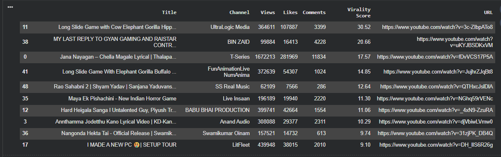
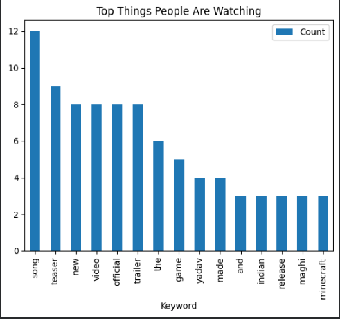
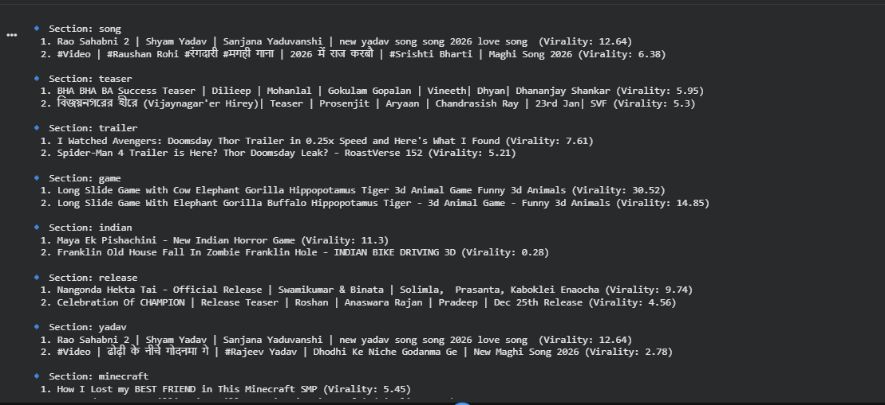

# Trending_Video_Tracker

## Description
`Trending_Video_Tracker` is a Python project that analyzes video content to identify top-performing videos across different categories (songs, teasers, trailers, etc.).  
The project ranks videos based on engagement metrics (views, likes, comments), extracts the top 2 videos per category, and generates visual insights.  

---

## Project Workflow
1. **Data Processing:**  
   - The code extracts video details such as title, category, views, likes, and comments.  
   - Videos are grouped by category.  

2. **Top Video Extraction:**  
   - Computes engagement metrics to identify **top 2 videos per section**.  

3. **Visualization & Insights:**  
   - Generates bar charts for top videos per section.  
   - Creates word clouds from video titles to identify trending keywords.  

4. **Outputs:**  
   - All charts, tables, and analysis results are stored in current repo.  
   - Example images are shown below:

**Top Videos per Section (Example)**  
  

**Trending of Keyword (Example)**  
  

**top 2 videos for each keyword(Example)**  
  

---

## Technologies Used
- Python  
- pandas, matplotlib, seaborn, wordcloud  
- Jupyter Notebook (for analysis and visualization)  

---
